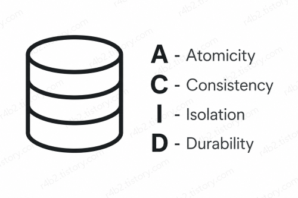
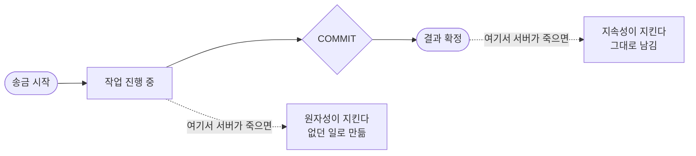

# [DB] 트랜잭션, ACID란 무엇인가

## 이 글에서 다루는 것

오늘은 트랜잭션이 무엇인지, 그리고 트랜잭션이 지켜야 할 4가지 원칙인 **ACID**를 기본적인 부분만 러프하게 다뤄보겠습니다.

> 이 글의 설명은 PostgreSQL 16 기준입니다. 

## 트랜잭션이란?

트랜잭션은 여러 데이터 작업을 **하나의 묶음으로 처리하는 것**입니다.

예를 들어 짱구가 철수에게 1만원을 송금한다고 가정해볼게요.

1. 짱구의 계좌에서 1만원을 뺀다.
2. 철수의 계좌에 1만원을 넣는다.

이 두 작업은 따로 처리되면 안 되고, **하나의 작업처럼 묶어서 처리**되어야 합니다.

이때 자주 등장하는 용어가 `COMMIT`과 `ROLLBACK`입니다.

- `COMMIT`: 작업이 정상적으로 끝났으니, **결과를 최종 확정하고 저장하는 것**
- `ROLLBACK`: 작업 도중 문제가 생겼으니, **지금까지 한 작업을 취소하고 이전 상태로 되돌리는 것**

쉽게 말하면,
- `COMMIT` = 저장 확정
- `ROLLBACK` = 취소하고 되돌리기

이라고 생각하시면 됩니다.

그리고 이 트랜잭션이 안전하게 동작하기 위해 지켜야 하는 4가지 특징을 앞글자만 따서 **ACID**라고 합니다.

## ACID란?

### 1. Atomicity - 원자성

**하나의 트랜잭션은 전부 성공하거나, 전부 실패해야 합니다.**

짱구가 철수에게 1만 원을 송금한다고 해보겠습니다.

1. 짱구 계좌에서 1만 원을 뺀다.
2. 철수 계좌에 1만 원을 넣는다.

그런데 짱구 계좌에서 돈은 빠졌는데, 오류가 발생해서 철수 계좌에는 돈이 들어가지 않았다면 큰 문제가 됩니다.

> 짱구: 돈 보냈어요~  
> 철수: 안 왔는데요?  
> 짱구: 저는 돈 나갔는데요?  
> 철수: 그건 모르겠고 경찰서에 신고할게요~

그래서 중간에 하나라도 실패하면 지금까지 처리한 내용을 `ROLLBACK`해서 처음 상태로 되돌립니다.

반대로 모든 작업이 정상적으로 끝났다면 `COMMIT`해서 결과를 확정합니다.

즉,

> 전부 성공하면 `COMMIT`, 하나라도 실패하면 `ROLLBACK`

이것이 **원자성**입니다.

---

### 2. Consistency - 일관성

**트랜잭션이 끝난 후에도 데이터가 정해진 규칙을 지켜야 합니다.**

예를 들어 데이터베이스에

> 계좌 잔액은 0원보다 작을 수 없다.

라는 규칙이 있다고 해보겠습니다.

트랜잭션이 실행됐다고 해서 잔액이 갑자기 -10,000원이 되는 등 기존의 규칙이 깨지면 안 됩니다.

즉,

> 작업 전에도 정상적인 데이터였다면, 작업 후에도 정상적인 데이터여야 한다.

이것이 **일관성**입니다.

> 참고로 DB가 지켜주는 건 우리가 **미리** 선언해 둔 규칙뿐입니다.
> 
> "계좌 잔액은 0원 미만이면 안 된다" 같은 규칙은 미리 선언해두면 DB가 알아서 막아줍니다.  
> 하지만 "**송금 전후로 두 계좌의 합이 같아야 한다**" 같은 규칙은 선언하기 어렵습니다.  
> 한쪽 계좌만 봐서는 판단할 수 없고, 상대방 계좌까지 같이 봐야 하기 때문입니다.
> 
> 이런 규칙은 DB가 대신 지켜주지 못합니다. 따라서 **개발자가 트랜잭션을 제대로 짜서 지켜야 합니다.**

---
### 3. Isolation - 격리성

**여러 트랜잭션이 동시에 실행되더라도 서로의 작업이 함부로 뒤섞이면 안 됩니다.**

예를 들어 잔액이 10만 원인 짱구의 계좌에, 출금 요청이 동시에 두 건 들어온다고 해보겠습니다.

- ATM에서 7만 원을 출금
- 휴대폰 앱에서 5만 원을 출금

두 요청이 동시에 **잔액이 10만 원이라고 확인한 뒤** 각각 출금을 처리해버리면, 실제로는 출금할 수 없는 금액까지 처리되는 문제가 생길 수 있습니다.

그래서 데이터베이스는 여러 트랜잭션이 동시에 실행될 때 **서로 얼마나 간섭하지 못하게 할지를 조절하는 장치**를 제공합니다.

즉,

> 여러 작업이 동시에 실행돼도 서로 얼마나 영향을 주고받을지를 조절한다.

이것이 **격리성**입니다.

> **여기서 반전이 하나 있습니다.**
>
> 위에서 든 동시 출금 예시는 사실 **DB 기본 설정에서는 막히지 않습니다.**  
> 격리성에는 여러 단계가 있는데, 기본값은 성능을 위해 일부러 느슨하게 잡혀 있기 때문입니다.
>
> 완전히 막으려면, 개발자가 단계를 직접 올리거나, 잠금을 거는 등 추가적인 작업이 필요합니다.  
> 어떤 단계들이 있고, 각각 무엇을 막아주는지는 [트랜잭션 격리 수준과 이상현상](002_격리수준과-이상현상.md)에서 다루겠습니다.

---

### 4. Durability - 지속성

**COMMIT된 결과는 이후에 문제가 발생하더라도 사라지면 안 됩니다.**

예를 들어 송금이 정상적으로 끝나서 `COMMIT`까지 완료됐다고 해보겠습니다.

그 직후 서버가 갑자기 꺼지더라도, 서버를 다시 켰을 때 송금 결과가 사라져 있으면 안 됩니다.

한 번 정상적으로 **COMMIT된 데이터는 확실하게 저장되어 유지**되어야 합니다.

즉,

> 한 번 확정된 결과는 사라지지 않는다.

이것이 **지속성**입니다.

#### 그럼 어디에 어떻게 저장되길래?

여기서 한 가지 궁금한 점이 생깁니다.

> `COMMIT`을 하면 데이터가 저장된다는데, 정확히 어디에 저장되는 걸까요?

당연히 **디스크**(파일)에 저장됩니다.  
메모리에만 있으면 서버가 꺼질 때 날아가 버리니까요.

그런데 여기에 문제가 하나 있습니다. **실제 테이블 파일에 바로 쓰는 건 느리다**는 점입니다.

고쳐야 할 데이터가 디스크 여기저기에 흩어져 있기 때문입니다.  
송금 한 번에 짱구의 계좌, 철수의 계좌, 거래 내역까지 서로 멀리 떨어진 위치를 찾아가서 고쳐야 하는데, `COMMIT`할 때마다 이걸 다 하면 DB가 버티지 못합니다.

그래서 데이터베이스는 다른 방법을 씁니다. 은행 창구를 떠올리면 쉽습니다.

> 창구 직원은 거래를 하나 할 때마다 두꺼운 장부를 뒤져서 고치지 않습니다.  
> 대신 **전표에 "누구 계좌에서 얼마 빼고, 누구에게 얼마 넣음"이라고 적고 도장을 찍습니다.**  
> 두꺼운 장부 정리는 나중에 한가할 때 몰아서 합니다.  
> 전표만 남아 있으면 장부는 언제든 다시 만들 수 있으니까요.

데이터베이스도 똑같습니다.

- **전표**는 한 파일에 순서대로 쭉 적으면 되니까 빠릅니다.
- **장부**(테이블 파일)는 여기저기 흩어져 있어서 느립니다.
- 그래서 `COMMIT`할 때는 **전표만 디스크에 확실히 적고**, 장부 반영은 나중에 천천히 합니다.
- 서버가 갑자기 꺼져도 괜찮습니다. 다시 켤 때 **전표를 처음부터 다시 읽어서 그대로 재실행**하면 복구되니까요.

이 전표에 해당하는 것을 **WAL**(Write-Ahead Logging)이라고 합니다.  
이름 그대로 "**미리**(Ahead) **쓰는**(Write) **기록**(Logging)"입니다.

#### COMMIT하고 저장하는 게 아닙니다

여기서 순서를 헷갈리기 쉽습니다. 저도 처음엔 이렇게 생각했습니다.

> `COMMIT` 성공 -> 디스크에 저장 -> 이때 서버가 죽으면? 저장 못 했으니 `ROLLBACK`되나?

그런데 실제 순서는 **정반대**입니다.

> 디스크에 전표 기록 완료 -> 그제서야 `COMMIT` 성공 응답

즉, **"디스크에 확실히 적혔다"는 것이 곧 "COMMIT 성공"의 의미**입니다.  
저장이 먼저고 응답이 나중입니다.

그래서 `COMMIT` 성공 응답을 받은 뒤에 서버가 죽으면 `ROLLBACK`되지 않고 **살아남습니다.**

반대로 기록 도중에 죽었다면 `ROLLBACK`되는 게 맞지만, 그 경우엔 애초에 성공 응답도 받지 못합니다.

정리하면 이렇습니다.

> **성공 응답을 받았는데 나중에 사라지는 일은 없다. 그것이 지속성이 보장하는 것이다.**

> **조금 더 들어가면**  
> MySQL 8.0(InnoDB)에도 `redo log`라는 같은 역할의 장치가 있습니다.
> 
> 이름과 세부 구현은 다르지만 "변경 기록을 먼저 남기고 실제 반영은 나중에 한다"는 원리는 같습니다.

### 마지막 정리

| 특징                  | 쉽게 말하면                            |
| ------------------- | --------------------------------- |
| **Atomicity 원자성**   | 전부 성공하면 `COMMIT`, 실패하면 `ROLLBACK` |
| **Consistency 일관성** | 작업 후에도 데이터 규칙을 지킨다                |
| **Isolation 격리성**   | 동시에 작업해도 서로 꼬이지 않게 한다             |
| **Durability 지속성**  | `COMMIT`된 결과는 사라지지 않는다            |

`COMMIT`을 기준으로 앞은 원자성, 뒤는 지속성이 맡습니다.

그리고 `COMMIT`과 `ROLLBACK`은 이렇게 기억하면 쉽습니다.

> `COMMIT` -> "문제없음. 이 결과로 확정!"  
> `ROLLBACK` -> "문제 생김. 하기 전으로 되돌리자!"

한줄요약: **ACID**는 트랜잭션을 안전하고 믿을 수 있게 처리하기 위한 **4가지 기본 원칙**입니다.

## 참고

- [PostgreSQL 16 - Transactions](https://www.postgresql.org/docs/16/tutorial-transactions.html)
- [PostgreSQL 16 - Write-Ahead Logging (WAL)](https://www.postgresql.org/docs/16/wal-intro.html)
