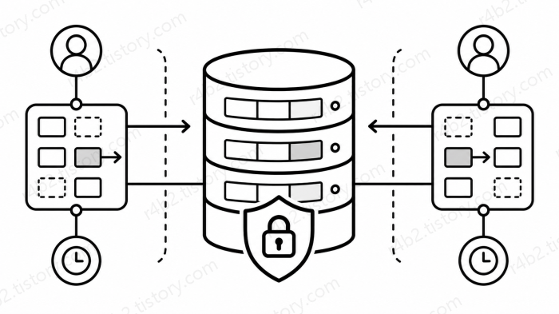
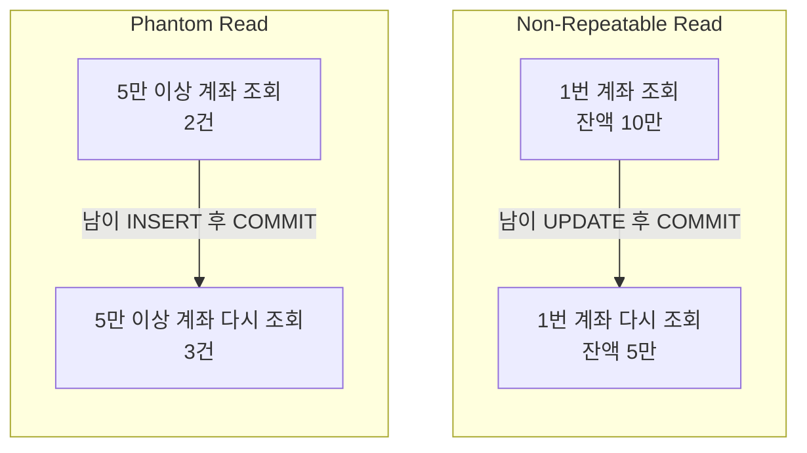
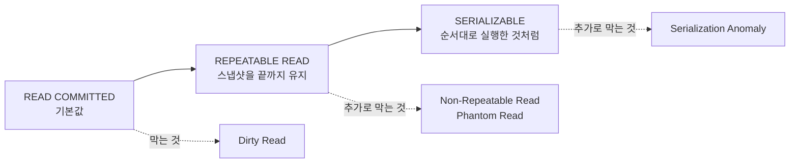

# [DB] 트랜잭션 격리 수준과 이상현상

## 이 글에서 다루는 것



이번에는 트랜잭션의 `Isolation - 격리성`을 다루다 파생된 내용에 대해서 다뤄보려고 합니다.

격리 수준의 차이에 따라 발생하는 이상현상 6가지를 설명하고, 격리 수준 4단계를 설명하고, 각 격리 수준이, 어떤 이상현상을 막을 수 있는지에 대하여 다루려고 합니다.

그리고 DB별로 동작이 다르다는 점을 감안해, 제가 주로 사용하는 PostgreSQL과 MySQL의 동작 차이를 보여드리려고 합니다.

이 글에 나오는 예시는 전부 **직접 돌려서 확인한 것**입니다.  
인터넷에 떠도는 표를 그대로 옮기면 PostgreSQL 기준으로는 **틀린 내용**이 되는 부분이 두 군데 있는데, 그 부분은 실제 실행 결과를 같이 붙여두었습니다.

> 이 글의 설명은 PostgreSQL 16 기준입니다.

## 앞 글에서 남긴 질문

이전 글 [트랜잭션, ACID란 무엇인가](001_acid.md)에서 이런 예시를 들었습니다.

잔액이 10만 원인 짱구의 계좌에, 출금 요청이 동시에 두 건 들어옵니다.

- ATM에서 7만 원을 출금
- 휴대폰 앱에서 5만 원을 출금

그리고 이렇게 남겨뒀습니다.

> 위에서 든 동시 출금 예시는 사실 **DB 기본 설정에서는 막히지 않습니다.**

이유를 설명하기 전에, 우리는 **격리 수준**이라는 말부터 알아야 합니다.

### 격리 수준이란?

앞 글에서 **격리성**을 이렇게 정리했습니다.

> 여러 작업이 동시에 실행돼도 서로 얼마나 영향을 주고받을지를 조절한다.

**격리 수준**을 쉽게 말하면,  
**"동시에 여러 사람이 DB를 건드릴 때, 남의 작업을 어디까지 볼지 정하는 정도"** 입니다.

여러 사람이 하나의 **공동 문서를 동시에 편집하는 상황**을 생각하면 이해하기 쉽습니다.

남이 아직 작성 중인 내용까지 바로 볼지, 저장이 끝난 내용만 볼지, 혹은 내가 작업하는 동안에는 처음 봤던 문서 상태를 그대로 유지할지 정할 수 있습니다.

DB의 격리 수준도 이와 비슷하게, 여러 트랜잭션이 동시에 실행될 때 **내 트랜잭션이 남의 변경 내용을 언제, 어디까지 볼지** 결정합니다.

즉, 여러 옵션이 있고, 우리가 직접 설정할 수 있는 값입니다.

한 가지 더 알아두시면 좋은 게 있습니다. 이 설정은 **각자 따로 겁니다.**  
같은 문서를 함께 편집해도 보기 방식은 사람마다 다르게 정할 수 있는 것처럼, DB에서도 **세션마다 격리 수준을 다르게 걸 수 있습니다.**

표준에는 이 단계가 4개 있습니다. 느슨한 쪽부터 `READ UNCOMMITTED`, `READ COMMITTED`, `REPEATABLE READ`, `SERIALIZABLE` 순입니다.

이름은 지금 외우지 않으셔도 됩니다. **낮을수록 빠르지만 덜 안전하고, 높을수록 안전하지만 느려진다**는 것만 기억하시면 됩니다.

그렇기에 우리는 어느 상황에서 어떤 옵션(격리 수준)을 골라야 할지를 알아야 합니다.

그렇기 위해선 각 격리 수준에 대해서 잘 알고 있어야겠죠?

> Q: 그냥 제일 안전한거 쓰면 안되나요? 보안도 좋고 최고 아니에요?  
> A: 그럴수도 있겠지만, 이 부분은 이후에 설명해드리겠습니다.

이제 우리는 격리 수준이 무엇인지 알게 되었으니, 아까의 예시에서 왜 막히지 않는지 설명을 이어가겠습니다.

### 왜 막히지 않는가?

이 글에서 다루는 PostgreSQL 16버전의 기본 격리 수준은 `READ COMMITTED`이고, 이건 일부러 느슨하게 잡힌 값입니다.

> 지금은 `READ COMMITTED` 이냐 `REPEATABLE READ` 이냐가 중요한 것이 아니니, 그냥 넘어가시고, 이 글을 전부 읽은 뒤, 한번 더 읽으시는 것을 권장합니다.

그런데 무엇이 느슨한 건지 알기 위해선, 먼저 **느슨하면 무슨 일이 생기는지**부터 알아야겠죠?

따라서 격리 수준보다 이상현상을 먼저 보겠습니다.

## 직접 재현해 보는 환경 만들기

이상현상은 글로만 읽으면 잘 안 남습니다.  
트랜잭션 두 개가 서로 끼어드는 그림이라서, 한 번 직접 돌려보시면 훨씬 오래 갑니다.

> 앞으로 모든 실습 환경에서는 Docker을 사용할 예정입니다.  
> 제 깃허브의 [공부 레포지토리](https://github.com/RabeMaster/learn)를 확인하시면, 모든 예제를 확인하실 수 있습니다.

이 글의 [실습 파일](https://github.com/RabeMaster/learn/tree/main/001_db/sql/002_격리수준)을 참고해주세요.

저장소를 clone하시면 아래 세 줄로 PostgreSQL 16과 MySQL 8.0이 같이 뜹니다.

```bash
git clone https://github.com/RabeMaster/learn.git
cd learn/lab
docker compose --profile db up -d
```

저장소 안의 SQL 파일을 세션에서 바로 실행하려면 clone하셔야 합니다.  
저장소 폴더째로 컨테이너 안에 들어가기 때문입니다.

여기서 중요한 게 하나 있습니다. **터미널 창을 두 개 열어야 합니다.**  
이상현상은 트랜잭션 두 개가 서로 간섭해야 재현되는데, 창이 하나면 한 번에 한 세션밖에 못 잡기 때문입니다.  
이 두 창이 앞으로 나올 표의 **세션 1**, **세션 2**가 됩니다.

각 창에서 이렇게 접속합니다.

```bash
# PostgreSQL
docker exec -it lab-pg psql -U ravenid -d labdb

# MySQL
docker exec -it lab-mysql mysql -u ravenid -pravenpw labdb
```

빠져나올 때는 psql은 `\q`, mysql은 `exit`입니다.

접속했다면 실습용 테이블을 만듭니다.  
PostgreSQL과 MySQL은 서로 다른 DB이니 **양쪽에 각각 한 번씩** 실행하셔야 합니다.

```sql
-- 001_db/sql/002_격리수준/00_setup.sql 의 accounts 부분
CREATE TABLE accounts (
    id      int PRIMARY KEY,
    owner   text NOT NULL,
    balance int  NOT NULL
);

INSERT INTO accounts VALUES (1, '짱구', 100000), (2, '철수', 60000);
```

기본 데이터로 짱구에게는 10만원을, 철수에게는 6만원을 넣어두었습니다.

시나리오를 하나 끝낼 때마다 아래로 초기화하시면 다음 실습이 깔끔합니다.

```sql
-- 001_db/sql/002_격리수준/00_reset.sql 의 accounts 부분
DELETE FROM accounts;
INSERT INTO accounts VALUES (1, '짱구', 100000), (2, '철수', 60000);
```

> 저장소를 받으셨다면 위 SQL을 직접 치지 않아도 됩니다.  
> 접속한 세션 안에서 한 줄이면 테이블이 다 만들어집니다. psql은 `\i`, mysql은 `source`입니다.  
> 위에는 `accounts` 부분만 실었고, 두 파일에는 뒤의 Write Skew 실습에서 쓸 `doctors` 테이블을 만들고 되돌리는 부분까지 같이 들어 있습니다.
>
> ```
> // psql
> \i /repo/001_db/sql/002_격리수준/00_setup.sql
> 
> // mysql
> source /repo/001_db/sql/002_격리수준/00_setup.sql
> ```
>
> 재현 스크립트는 전부 [이 글의 sql 폴더](https://github.com/RabeMaster/learn/tree/main/001_db/sql/002_격리수준)에 있고, 어느 창에 어떤 순서로 실행할지가 주석으로 적혀 있습니다.  
> 
> 컨테이너를 띄우고 내리는 자세한 방법은 [lab 폴더](https://github.com/RabeMaster/learn/tree/main/lab)에 정리해 두었습니다.

### 시작하기 전에 지금 격리 수준부터

앞으로 시나리오마다 **어떤 격리 수준에서 돌리는지가 다릅니다.** 만약 앞 실습에서 바꿔둔 값이 세션에 남아 있으면 다음 실습때 이상현상이 정상적으로 재현되지 않습니다.

그래서 시나리오마다 맨 앞에 **시작 전**이라는 줄을 달아두었습니다.  
거기 적힌 값과 지금 내 세션이 같은지만 확인하고 들어가시면 됩니다.

여기서 헷갈리기 쉬운 게 하나 있습니다.  
**격리 수준은 읽는 쪽 세션에 겁니다.**

격리 수준은 **"내가 남의 것을 어디까지 볼지"를** 정하는 값입니다.  
"내 것을 남에게 어디까지 보여줄지"가 아닙니다.

그래서 데이터를 고치는 세션이 아니라, **그 값을 읽어서 이상현상을 확인하는 세션**에 걸어야 합니다.  
바로 뒤에 나올 Dirty Read는 세션 2가 세션 1의 미확정 값을 읽는 현상이니, 세션 2에 걸어야 재현됩니다. 세션 1에 걸면 아무 일도 일어나지 않습니다.

| | PostgreSQL 16 | MySQL 8.0 |
| --- | --- | --- |
| 지금 값 보기 | `SHOW transaction_isolation;` | `SELECT @@transaction_isolation;` |
| 접속 직후 기본값 | `read committed` | `REPEATABLE-READ` |
| 기본값으로 되돌리기 | `RESET ALL;` | `SET SESSION transaction_isolation = DEFAULT;` |

**기본값부터 서로 다르다**는 점을 눈여겨봐 주세요.  
뒤에서 두 DB의 결과가 갈리는 이유가 대부분 여기에 있습니다.

제일 확실한 초기화는 **접속을 끊고 다시 들어가는 것**입니다.  
세션에 걸어둔 설정은 접속이 끊기면 전부 사라집니다.

### MySQL로 따라 하신다면

앞으로 나오는 SQL은 전부 PostgreSQL 16 기준입니다.  
그런데 **격리 수준을 다루는 명령만 문법이 다릅니다.** `BEGIN`, `SELECT`, `UPDATE`, `COMMIT`, `ROLLBACK`은 양쪽이 똑같습니다.

**지금 실행하실 필요는 없습니다.**  
실습에서 격리 수준을 바꾸라고 할 때 이 자리로 돌아와 확인하시면 됩니다.

```sql
-- PostgreSQL 16
SET SESSION CHARACTERISTICS AS TRANSACTION ISOLATION LEVEL READ UNCOMMITTED;
```

```sql
-- MySQL 8.0
SET SESSION TRANSACTION ISOLATION LEVEL READ UNCOMMITTED;
```

둘 다 **`BEGIN` 앞에서** 입력합니다. 자리는 같고 문법만 다릅니다.

그리고 이 설정은 **세션에 계속 남습니다.**  
트랜잭션이 끝나도 풀리지 않으니, 실습을 하나 마치면 위 표의 "기본값으로 되돌리기"로 정리하고 넘어가시는 편이 좋습니다.

> 격리 수준을 트랜잭션 하나에만 거는 방법도 있습니다.  
> 그런데 그 명령은 두 DB에서 써야 하는 자리가 서로 반대라 헷갈리기 쉽습니다.  
> 그래서 이 글에서는 세션 단위로 통일했습니다.  
> 
> 이 차이는 추후 "트랜잭션의 시작과 끝" 글에서 따로 다루겠습니다.

### 실습 중에 세션이 꼬였다면

앞으로 나오는 시나리오는 전부 `BEGIN;`으로 시작합니다.  
앞 글에서 본 것처럼 **여기서부터 한 묶음**이라고 알리는 명령입니다.  
`START TRANSACTION;`으로 쓰셔도 이 글의 실습에서는 결과가 같습니다.

> 사실 이 둘은 MySQL에서 미묘하게 다릅니다.  
> 실습에 지장은 없으니 여기서는 넘어가고, 추후 "트랜잭션의 시작과 끝" 글에서 따로 다루겠습니다.

그런데 실습을 하다 보면 지금 트랜잭션이 열려 있는지 헷갈려서 `BEGIN;`을 한 번 더 치게 되는 순간이 옵니다.  

이때 두 DB의 반응이 다릅니다.

|이렇게 하면|PostgreSQL 16|MySQL 8.0|
|---|---|---|
|`BEGIN` 뒤에 또 `BEGIN`|경고만 뜨고 무시|**기존 트랜잭션이 커밋되고** 새 트랜잭션 시작|
|`COMMIT`, `ROLLBACK`을 여러 번|경고만 뜨고 **추가 영향 없음**|**추가 영향 없음**|
|트랜잭션 도중 에러가 났을 때|트랜잭션이 **실패 상태**가 되어 `ROLLBACK` 전까지 후속 작업 불가|해당 문장만 실패하고 트랜잭션은 계속 유지|

**첫 줄이 제일 위험합니다.** MySQL은 트랜잭션을 겹쳐서 열 수 없어서, 새로 시작하기 전에 열려 있던 것을 먼저 커밋해 버립니다.  
그 사이에 해둔 `UPDATE`가 그대로 확정되는데 **에러도 경고도 안 뜹니다.**  
뒤늦게 `ROLLBACK`을 쳐도 되돌아가지 않습니다.  
PostgreSQL은 반대로 경고만 띄우고 무시하며, 하던 트랜잭션은 그대로 이어집니다.

세 번째 줄도 곧 만나시게 됩니다.  
뒤에 **일부러 에러를 내는 실습**이 있는데, PostgreSQL에서 그 에러를 본 다음 명령을 치면 이렇게 나옵니다.

```
ERROR:  current transaction is aborted, commands ignored until end of transaction block
```

> 대충 **트랜잭션이 중단되었습니다. 트랜잭션이 끝날때까지 모든 명령이 무시됩니다.** 라는 뜻입니다.

고장 난 게 아니라 `ROLLBACK`을 기다리는 상태입니다.  
MySQL은 이렇게 잠기지 않고, 실패한 그 문장만 없던 일이 됩니다.

정리하면 **꼬였다 싶을 때는 `ROLLBACK;`을 한 번 치고 다시 시작하시면 됩니다.**  
위 표의 두 번째 줄처럼 열린 트랜잭션이 없을 때 쳐도 아무 일이 없으니, 헷갈리면 일단 치셔도 손해가 없습니다.   

데이터까지 처음으로 돌리려면 앞의 `00_reset.sql`을 실행하시면 됩니다.

## 이상현상에는 어떤 것들이 있나

설명듣느라 고생하셨습니다.  
드디어 이제 격리가 느슨하면 무슨 일이 생기는지 하나씩 보겠습니다.  

모두 여섯 가지인데, 간단하게 먼저 이름과 한 줄 설명으로 전체를 훑고 가겠습니다.

| 이상현상                  | 쉽게 말하면                            |
| --------------------- | --------------------------------- |
| Dirty Read            | **아직 확정되지 않은 값을 미리 봄**            |
| Non-Repeatable Read   | **같은 데이터를 다시 봤는데 값이 바뀜**          |
| Phantom Read          | **같은 조건으로 다시 봤는데 없던 행이 생김**       |
| Lost Update           | **내 수정이 다른 사람 수정에 덮어써져 사라짐**      |
| Write Skew            | **각자 따로 수정했는데 전체 규칙이 깨짐**         |
| Serialization Anomaly | **동시에 처리해서 순서대로는 나올 수 없는 결과가 생김** |

앞의 세 가지는 **SQL 표준에 정의된 것**입니다.  
`Lost Update`와 `Write Skew`는 **표준 표에 없습니다.**  
그런데 실무에서는 오히려 이 둘을 자주 만나게 됩니다.  
마지막 `Serialization Anomaly`는 다시 표준 표에 있는 항목입니다.

여기서는 **앞의 네 가지를 먼저** 보겠습니다.  
뒤의 두 가지는 격리 수준을 다룬 다음에 이어서 봅니다.  
그 둘은 **격리 수준을 올려도 남는 문제**라서, 격리 수준이 무엇인지 모르는 상태로는 설명이 되지 않기 때문입니다.

---

### 1. Dirty Read

**아직 COMMIT되지 않은 남의 데이터를 읽는 것입니다.**

> **시작 전** - 두 세션 다 기본값 그대로 시작합니다. 격리 수준을 내리는 건 표 아래에서 따로 해봅니다.  
> 재현 순서는 [01_dirty_read.sql](https://github.com/RabeMaster/learn/blob/main/001_db/sql/002_격리수준/01_dirty_read.sql)에 있습니다.

|시간|세션 1|세션 2|
|---|---|---|
|1|`BEGIN;`||
|2|`UPDATE accounts SET balance = 0 WHERE id = 1;`||
|3||`SELECT balance FROM accounts WHERE id = 1;`|
|4||여기서 `0`이 보이면 Dirty Read|
|5|`ROLLBACK;`||
|6||세션 2가 본 `0`은 결국 확정되지 않은 값|

4번에서 세션 2가 본 `0`은 아직 **COMMIT되지 않은 값**입니다.

그런데 세션 1이 5번에서 `ROLLBACK`을 하면, 잔액은 다시 원래 값으로 돌아갑니다.  
즉 세션 2는 **결국 취소될 값을 미리 읽은 것**입니다.

앞 글에서 원자성을 설명할 때, 트랜잭션 도중 문제가 생기면 작업 전체를 없던 일로 되돌린다고 했습니다.  
Dirty Read는 쉽게 말해 **나중에 취소될 수도 있는 값을 다른 트랜잭션이 먼저 읽어버리는 현상**입니다.

예를 들어 세션 2가 잔액 `0`을 보고  
"잔액이 없으니 자동이체를 실패 처리하자"라고 판단했다고 해보겠습니다.

그런데 잠시 뒤 세션 1이 `ROLLBACK`을 해서 잔액이 다시 `100000`원이 되었습니다.

결과적으로 세션 2는 **실제로는 잔액이 충분한 계좌를 잔액 부족으로 잘못 처리한 것**이 됩니다.

> 세션 2에서 3번 명령어를 실행했을 때 `100000`이 조회되셨다면 정상입니다.  
> **PostgreSQL과 MySQL 둘 다** 기본값 그대로는 `0`이 보이지 않습니다. 그 이유를 아래에서 설명하겠습니다.

#### 기본값에서는 양쪽 다 재현되지 않습니다

두 DB의 기본 격리 수준이 애초에 Dirty Read를 막는 단계이기 때문입니다.

| | 접속 직후 기본값 | Dirty Read |
| --- | --- | --- |
| PostgreSQL 16 | `READ COMMITTED` | 막음 |
| MySQL 8.0 | `REPEATABLE READ` | 막음 |

그러면 격리 수준을 제일 낮은 `READ UNCOMMITTED`로 내리면 어떻게 될까요?  
**여기서부터 두 DB가 갈립니다.**

#### PostgreSQL은 격리 수준을 내려도 재현되지 않습니다

세션 2에서 격리 수준을 내리고 확인해 봅니다.

```sql
-- 001_db/sql/002_격리수준/01_dirty_read.sql
SET SESSION CHARACTERISTICS AS TRANSACTION ISOLATION LEVEL READ UNCOMMITTED;
SHOW transaction_isolation;
```

```
 transaction_isolation
-----------------------
 read uncommitted
```

`read uncommitted`가 그대로 나옵니다.  
**요청 자체는 받아들여졌습니다.**  
그런데 이 상태에서 위 표의 3번을 실행하면 이렇게 나옵니다.

```
 balance
---------
  100000
```

왓? 격리 수준은 분명히 제일 낮은데도, 세션 1이 커밋하지 않은 `0`을 보지 못합니다.

여기가 헷갈리기 쉬운 지점입니다.  
**표시되는 값과 실제 동작이 다릅니다.**  

PostgreSQL 공식 문서를 보면 다음과 같이 설명하고 있습니다.

> "In PostgreSQL, you can request any of the four standard transaction isolation levels, but internally only three distinct isolation levels are implemented, i.e., PostgreSQL's Read Uncommitted mode behaves like Read Committed."
> 
> 출처: [PostgreSQL 16 - Transaction Isolation](https://www.postgresql.org/docs/16/transaction-iso.html)

쉽게 말하면, **4가지 표준 격리 수준을 모두 설정할 수는 있지만 실제 내부 동작은 3가지로 나뉜다**는 뜻입니다.

PostgreSQL에서는 `READ UNCOMMITTED`를 설정하더라도 실제로는 `READ COMMITTED`와 동일하게 동작합니다.

따라서 **격리 수준의 이름은 4개지만, 실제 동작을 기준으로 보면 3개라고 볼 수 있습니다.**

그렇다면 다른 DBMS도 같을까요?  
같은 실습을 MySQL 8.0에서 진행해 보면 PostgreSQL과는 다른 결과가 나옵니다.

세션 2에서 격리 수준을 내리고 확인해 봅니다.

```sql
-- 001_db/sql/002_격리수준/01_dirty_read.sql 에 [MySQL] 주석 안내로 들어 있습니다
SET SESSION TRANSACTION ISOLATION LEVEL READ UNCOMMITTED;
SELECT @@transaction_isolation;
```

```
+-------------------------+
| @@transaction_isolation |
+-------------------------+
| READ-UNCOMMITTED        |
+-------------------------+
```

이 상태에서 위 표의 3번을 실행하면 이렇게 나옵니다.

```
+---------+
| balance |
+---------+
|       0 |
+---------+
```

**MySQL에서는 0이 읽힙니다.**  
곧 롤백돼서 사라질 값인데도 보입니다.
이것이 진짜 Dirty Read입니다.

정리하면 이렇습니다.

| 세션 2의 격리 수준            | PostgreSQL 16 | MySQL 8.0 |
| ---------------------- | ------------- | --------- |
| 기본값 그대로                | `100000`      | `100000`  |
| `READ UNCOMMITTED`로 내림 | `100000`      | **`0`**   |

**갈리는 자리는 오른쪽 아래 한 칸뿐입니다.**  
격리 수준을 둘 다 제일 낮은 `READ UNCOMMITTED`로 내렸는데 PostgreSQL은 `100000`, MySQL은 `0`이 나옵니다.  
제가 처음에 "DB별로 동작이 다르다"고 말씀드린 게 이런 부분입니다.

> 한줄 요약: PostgreSQL은 `READ UNCOMMITTED`를 지원하지만 `READ COMMITTED`처럼 동작하고, MySQL은 실제로 Dirty Read가 발생할 수 있다.

---

### 2. Non-Repeatable Read

**같은 행을 두 번 읽었는데 값이 달라지는 것입니다.**

> **시작 전** - PostgreSQL은 기본값 그대로 두시면 됩니다.  
> MySQL은 기본값이 `REPEATABLE READ`라 이대로는 재현되지 않습니다.  
> 세션 1을 `READ COMMITTED`로 내려주세요.  
> 재현 순서는 [02_non_repeatable_read.sql](https://github.com/RabeMaster/learn/blob/main/001_db/sql/002_격리수준/02_non_repeatable_read.sql)에 있습니다.

| 시간  | 세션 1                                                     | 세션 2                                                |
| --- | -------------------------------------------------------- | --------------------------------------------------- |
| 1   | `BEGIN;`                                                 | `BEGIN;`                                            |
| 2   | `SELECT balance FROM accounts WHERE id = 1;` -> `100000` |                                                     |
| 3   |                                                          | `UPDATE accounts SET balance = 50000 WHERE id = 1;` |
| 4   |                                                          | `COMMIT;`                                           |
| 5   | `SELECT balance FROM accounts WHERE id = 1;` -> `50000`  |                                                     |
| 6   | `COMMIT;`                                                |                                                     |

Dirty Read와 결정적으로 다른 점이 있습니다.  
**여기서는 세션 2가 잘못한 게 하나도 없습니다.**  

정상적으로 `UPDATE`하고 `COMMIT`까지 마쳤습니다.  
세션 1이 5번에서 읽은 `50000`도 확정된 정상 값입니다.

문제는 **세션 1 안에서 앞뒤가 맞지 않는다**는 것입니다.  
분명 같은 트랜잭션 안에서 같은 질문을 두 번 했는데 답이 달라졌으니까요.

예를 들어 이자를 계산하는 트랜잭션이 있다고 해보겠습니다.

1. 잔액을 읽어서 화면에 "현재 잔액 10만 원"이라고 보여줍니다.
2. 같은 트랜잭션에서 잔액을 다시 읽어 이자를 계산합니다.

2번에서 읽은 값이 5만 원이라면, 화면에는 10만 원이라고 떠 있는데 이자는 5만 원 기준으로 붙습니다.  
**한 화면 안에서 숫자가 서로 안 맞는 상황**이 됩니다.

> **조금 더 들어가면**
>
> 같은 행이 아니라 **서로 관련된 다른 행**에서 같은 일이 나는 경우를 **Read Skew**라고 부릅니다.  
> 이체 도중에 짱구 계좌는 이체 전 값, 철수 계좌는 이체 후 값을 읽어서 합계가 안 맞는 식입니다.  
> 생기는 조건도 막히는 격리 수준도 Non-Repeatable Read와 같아서, 이 글에서는 따로 다루지 않습니다.

---

### 3. Phantom Read

**같은 조건으로 두 번 조회했는데 행의 개수가 달라지는 것입니다.**

> **시작 전** - 바로 앞 실습과 같습니다. PostgreSQL은 기본값, MySQL은 세션 1을 `READ COMMITTED`로 내려주세요.  
> 재현 순서는 [03_phantom_read.sql](https://github.com/RabeMaster/learn/blob/main/001_db/sql/002_격리수준/03_phantom_read.sql)에 있습니다.

| 시간  | 세션 1                                                           | 세션 2                                            |
| --- | -------------------------------------------------------------- | ----------------------------------------------- |
| 1   | `BEGIN;`                                                       | `BEGIN;`                                        |
| 2   | `SELECT count(*) FROM accounts WHERE balance >= 50000;` -> `2` |                                                 |
| 3   |                                                                | `INSERT INTO accounts VALUES (3, '유리', 80000);` |
| 4   |                                                                | `COMMIT;`                                       |
| 5   | `SELECT count(*) FROM accounts WHERE balance >= 50000;` -> `3` |                                                 |
| 6   | `COMMIT;`                                                      |                                                 |

5번을 보시면, 같은 트랜잭션이지만, 기존에는 결과가 2개가 나왔던게, 3개가 나왔습니다.  
없던 행이 유령처럼 나타난다고 해서 Phantom(유령)이라는 이름이 붙었습니다.

`INSERT`만 해당하는 건 아닙니다. 세션 2가 `DELETE`를 해서 **있던 행이 사라지는 것**도 똑같이 Phantom Read입니다.

#### 2번과 3번은 뭐가 다른가

이 글에서 제일 헷갈리는 부분입니다. 둘 다 "두 번 읽었더니 달라졌다"로 보이니까요.  
한 줄로 줄이면 이렇습니다.

- **Non-Repeatable Read**: 이미 읽은 행의 **값**이 바뀐다 (남의 `UPDATE`)
- **Phantom Read**: 조건에 맞는 행의 **개수**가 바뀐다 (남의 `INSERT`, `DELETE`)



**행을 지목해서 읽었느냐, 조건으로 훑어서 읽었느냐의 차이**라고 보시면 됩니다.

`WHERE id = 1`처럼 특정 행 하나를 콕 집어 읽으면, 그 행의 값이 바뀌는 것만 걱정하면 됩니다.  
그런데 `WHERE balance >= 50000`처럼 조건으로 훑으면, 내가 읽는 동안 그 조건에 맞는 행이 새로 생길 수도 있습니다.  
지켜야 할 범위 자체가 넓어지는 셈입니다.

---

### 4. Lost Update

**두 트랜잭션이 같은 행을 각자 읽고 각자 계산해서 덮어쓰는 바람에, 한쪽의 결과가 사라지는 것입니다.**

앞 글에서 남긴 동시 출금 예시가 이것입니다.  
짱구의 계좌 하나에 출금 요청이 두 건 들어옵니다.

> **시작 전** - 앞 실습에서 격리 수준을 내리셨다면 되돌려주세요. 이번에는 **양쪽 다 기본값 그대로** 돌립니다.  
> 재현 순서는 [04_lost_update.sql](https://github.com/RabeMaster/learn/blob/main/001_db/sql/002_격리수준/04_lost_update.sql)에 있습니다.

| 시간  | 세션 1 (ATM, 7만 원 출금)                                      | 세션 2 (앱, 5만 원 출금)                                             |
| --- | -------------------------------------------------------- | ------------------------------------------------------------- |
| 1   | `BEGIN;`                                                 | `BEGIN;`                                                      |
| 2   | `SELECT balance FROM accounts WHERE id = 1;` -> `100000` |                                                               |
| 3   |                                                          | `SELECT balance FROM accounts WHERE id = 1;` -> `100000`      |
| 4   | 서버에서 계산: `100000 - 70000 = 30000`                        |                                                               |
| 5   |                                                          | 서버에서 계산: `100000 - 50000 = 50000`                             |
| 6   | `UPDATE accounts SET balance = 30000 WHERE id = 1;`      |                                                               |
| 7   |                                                          | `UPDATE accounts SET balance = 50000 WHERE id = 1;` -> **대기** |
| 8   | `COMMIT;`                                                |                                                               |
| 9   |                                                          | 대기가 풀리고 `50000`으로 덮어씀                                         |
| 10  |                                                          | `COMMIT;`                                                     |

**최종 잔액: 50000원**

12만 원이 빠져나갔는데 잔액은 5만 원입니다.  
ATM에서 뽑은 7만 원이 **통째로 사라졌습니다.**

> 짱구: ATM에서 7만 원 뽑고, 앱으로 5만 원 더 뽑았어요.  
> 짱구: 12만 원 나갔는데 왜 잔액이 5만 원이죠?  
> 은행: 저희 기록에는 5만 원만 나간 걸로...  
> 짱구: 제 손에 7만 원 있는데요? 나이스 ㅋㅋ

돈이 없어진 쪽은 짱구가 아니라 은행입니다.  
7만 원을 내주고도 기록에는 안 남았으니까요.

여기서 꼭 짚고 넘어갈 게 있습니다. **DB가 아무것도 안 한 게 아닙니다.**

7번을 보시면 세션 2가 **대기**에 걸립니다. 세션 1이 잡아둔 행 잠금이 풀릴 때까지 DB가 제대로 기다려줍니다. 순서도 지켜집니다.

문제는 **기다린 다음에 하는 일**입니다. 세션 2가 손에 들고 있는 `50000`은 3번에서 읽은 **옛날 잔액 10만 원**을 보고 계산한 값입니다. 그런데 대기가 풀리자 그걸 그대로 덮어씁니다.

즉 **DB는 순서는 지켜줬지만, 그 계산 시점의 데이터가 이미 낡았다는 건 모릅니다.** 세션 2가 건네준 숫자를 의심할 이유가 없으니까요.

> **표준 이상현상 표에는 Lost Update가 없습니다.**
>
> 앞의 세 가지(Dirty Read, Non-Repeatable Read, Phantom Read)와 달리 SQL 표준의 격리 수준 표에는 이 항목이 안 나옵니다.  
> 
> 그런데 실무에서 제일 자주 터지는 게 이겁니다.   
> **표에 없으니 안 중요한 게 아니라, 표에 없는데도 제일 자주 만나게 되는 문제**라고 기억해두시면 좋습니다.

## 격리 수준 4단계

이제 이상현상을 봤으니, 이걸 막는 손잡이를 볼 차례입니다.

먼저 이 손잡이가 **무엇과 무엇을 맞바꾸는지**부터 알아야 하는데, 답은 **안전과 동시성**입니다.

격리를 높이면 안전해지지만, 그만큼 대기와 재시도가 늘어나서 느려집니다.  
공짜로 안전해지는 게 아닙니다.

그리고 각 수준을 외우실 때 요령이 하나 있습니다. **"무엇을 막는지"보다 "무엇을 여전히 허용하는지"로 기억하는 것**입니다.

격리 수준은 이렇게 바꿉니다.

```sql
-- 현재 세션 전체에 적용 (BEGIN 앞에서 칩니다)
SET SESSION CHARACTERISTICS AS TRANSACTION ISOLATION LEVEL REPEATABLE READ;

-- 확인
SHOW transaction_isolation;

-- 기본값으로 되돌리기
RESET ALL;
```

### READ UNCOMMITTED

표준상으로는 Dirty Read까지 허용하는 **제일 낮은 단계**입니다.  
남이 커밋하지 않은 값도 그냥 보여줍니다.

그런데 앞서 Dirty Read 실습에서 확인했듯이, **PostgreSQL 16에는 이 단계가 사실상 없습니다.**  
요청하면 받아주긴 하지만 실제로는 `READ COMMITTED`로 동작합니다.

왜 이렇게 만들었을까요? 공식 문서가 이유까지 적어두었습니다.

> "This is because it is the only sensible way to map the standard isolation levels to PostgreSQL's multiversion concurrency control architecture."
>
> 출처: [PostgreSQL 16 - Transaction Isolation](https://www.postgresql.org/docs/16/transaction-iso.html)

PostgreSQL은 **MVCC**(다중 버전 동시성 제어)라는 구조를 씁니다.  
데이터를 고칠 때 원본을 덮어쓰는 게 아니라 **새 버전을 따로 만들어 두고, 각 트랜잭션에게 그 시점에 맞는 버전을 보여주는** 방식입니다.  

따라서 이 구조에서는 애초에 "커밋되지 않은 버전"을 남에게 보여줄 통로가 없습니다.  
그래서 표준의 `READ UNCOMMITTED`를 흉내 낼 방법이 없고, 제일 가까운 `READ COMMITTED`로 매핑해둔 것입니다.

> MVCC가 정확히 어떻게 동작하는지는 다음 글인 "MVCC, 읽기가 쓰기를 막지 않는 이유"에서 따로 다루겠습니다.

### READ COMMITTED

**PostgreSQL 16의 기본값**입니다. 이름 그대로 커밋된 것만 읽습니다.

동작 방식이 중요합니다. **각 SQL 문이 시작될 때마다 그 시점의 스냅샷을 새로 뜹니다.**  
사진을 찍는다고 생각하시면 됩니다.  

`SELECT` 한 번에 사진 한 장입니다.

- 커밋된 것만 사진에 담기니까 -> **Dirty Read는 없습니다.**
- 그런데 문장마다 사진을 새로 찍으니까 -> **Non-Repeatable Read와 Phantom Read는 그대로 발생합니다.**

앞에서 재현한 2번과 3번 실습이 전부 이 기본값에서 나온 결과입니다.  
별도로 격리 수준을 올리지 않았는데도 재현됐던 이유가 여기 있습니다.

### REPEATABLE READ

**트랜잭션의 첫 SQL 문 시점에 뜬 스냅샷을, 트랜잭션이 끝날 때까지 계속 씁니다.**

사진을 문장마다 새로 찍는 게 아니라, **처음에 한 장 찍어놓고 끝까지 그 사진만 보는 것**입니다.  
그러니 몇 번을 읽어도 같은 값이 나옵니다. Non-Repeatable Read가 사라집니다.

그런데 여기서 **자료마다 설명이 엇갈리는 지점**이 나옵니다.

인터넷에 돌아다니는 표를 보면 대부분 "`REPEATABLE READ`는 Phantom Read를 허용한다"고 되어 있습니다.  
표준 기준으로는 맞는 말입니다. 하지만 **PostgreSQL에서는 틀립니다.**

앞의 Phantom Read 실습을, 세션 1만 `REPEATABLE READ`로 올려서 다시 돌려보겠습니다.

```sql
-- 001_db/sql/002_격리수준/03_phantom_read.sql 맨 아래에 주석 안내로 들어 있습니다
SET SESSION CHARACTERISTICS AS TRANSACTION ISOLATION LEVEL REPEATABLE READ;
BEGIN;
SELECT count(*) FROM accounts WHERE balance >= 50000;
```

```
 count
-------
     2
```

이 상태에서 세션 2가 유리의 계좌를 `INSERT`하고 `COMMIT`한 뒤, 세션 1에서 같은 조회를 다시 하면 이렇게 나옵니다.

```
 count
-------
     2
```

**3이 아니라 2입니다.** Phantom Read가 막혔습니다. 이것도 공식 문서에 명시되어 있습니다.

> "The table also shows that PostgreSQL's Repeatable Read implementation does not allow phantom reads. This is acceptable under the SQL standard because the standard specifies which anomalies must not occur at certain isolation levels; higher guarantees are acceptable."
>
> 출처: [PostgreSQL 16 - Transaction Isolation](https://www.postgresql.org/docs/16/transaction-iso.html)

표준은 **"최소한 이것만은 막아라"를 정한 것**이지, "이건 반드시 허용해라"를 정한 게 아닙니다. 그래서 더 강하게 막는 것은 표준 위반이 아닙니다.

정리하면 **인터넷에 떠도는 표를 그대로 옮겨 적으면 PostgreSQL 기준으로는 틀린 글이 됩니다.**  
표를 볼 때는 그게 표준 기준인지, 아니면 특정 DB 기준인지 꼭 확인하셔야 합니다.

#### 다만 공짜는 아닙니다

그럼 격리 수준만 올리면 앞의 Lost Update도 해결될까요? 확인해 보겠습니다.  

재현 순서는 [05_lost_update_repeatable_read.sql](https://github.com/RabeMaster/learn/blob/main/001_db/sql/002_격리수준/05_lost_update_repeatable_read.sql)에 있습니다.

두 세션 모두 `REPEATABLE READ`로 올리고 똑같은 순서로 출금을 돌립니다.

여기서 하나 짚고 가겠습니다. 앞에서 격리 수준은 **읽는 쪽 세션에 건다**고 했는데, 이번에는 왜 두 세션 모두에 걸까요?

앞의 시나리오들은 역할이 나뉘어 있었습니다. 한쪽은 데이터를 고치는 쪽이고, 다른 쪽은 그 값을 읽어서 이상현상을 확인하는 쪽이었습니다. 그래서 읽는 쪽에만 걸면 충분했습니다.

그런데 이번에는 두 세션 다 **읽고, 계산하고, 씁니다.** 둘 다 읽는 쪽이면서 동시에 쓰는 쪽입니다.  

그리고 에러는 늦게 덮어쓰려던 세션에서 발생하는데, 실제 서비스에서는 두 요청 중 누가 늦을지 미리 알 수 없습니다.  

그래서 어느 쪽이 늦더라도 막히도록 **양쪽 모두에 걸어야 합니다.**

세션 2가 대기에서 풀리는 순간, 잔액이 알아서 맞춰지는 게 아니라 이렇게 됩니다.

```
ERROR:  could not serialize access due to concurrent update
```

**에러가 납니다.** 그리고 세션 2의 트랜잭션은 통째로 취소됩니다.  
최종 잔액을 보면 `30000`으로, ATM 출금분만 반영되어 있습니다.  
휴대폰 앱에서 시도한 5만 원 출금은 **아예 실패했습니다.**

덮어써서 돈이 사라지는 것보다는 낫지만, 그냥 두면 사용자 입장에서는 출금이 실패한 것입니다.  
그래서 공식 문서는 이렇게 하라고 안내합니다.

> "it should abort the current transaction and retry the whole transaction from the beginning."
>
> 출처: [PostgreSQL 16 - Transaction Isolation](https://www.postgresql.org/docs/16/transaction-iso.html)

**"트랜잭션을 처음부터 다시 돌려라"는 뜻**입니다.  
즉 격리 수준을 올린다고 애플리케이션이 알아서 안전해지는 게 아니라, **애플리케이션에 이 에러를 잡아서 재시도하는 코드가 반드시 있어야 합니다.** 없으면 그냥 에러입니다.

다만 이 부담이 모든 곳에 생기는 건 아닙니다. 같은 문서에 이런 단서가 붙어 있습니다.

> "Note that only updating transactions might need to be retried; read-only transactions will never have serialization conflicts."
>
> 출처: [PostgreSQL 16 - Transaction Isolation](https://www.postgresql.org/docs/16/transaction-iso.html)

**재시도가 필요한 건 데이터를 고치는 트랜잭션뿐이고, 읽기만 하는 트랜잭션은 이 충돌이 나지 않습니다.**  

즉, 조회용 코드까지 전부 손봐야 하는 건 아니라는 뜻입니다.

### SERIALIZABLE

**제일 강한 단계**입니다.  
동시에 실행됐더라도 결과가 **"하나씩 순서대로 실행한 것과 같음"을 보장**합니다.

그런데 `REPEATABLE READ`가 Phantom Read까지 막아준다면, 대체 뭐가 더 남았길래 이 단계가 따로 있을까요?

**앞에서 미뤄둔 이상현상 두 가지가 바로 그것입니다.** 이제 격리 수준을 알았으니 이어서 보겠습니다.

## 미뤄둔 두 가지 이상현상

### 5. Write Skew

**각자 다른 데이터를 수정했는데 전체 규칙이 깨지는 것입니다.**

`REPEATABLE READ`로 올려도 막히지 않습니다. 직접 확인해 보겠습니다.

병원에 이런 규칙이 있다고 해보겠습니다.

> 당직자는 항상 **최소 한 명**이 남아 있어야 한다.

이 시나리오는 계좌가 아니라 당직표를 씁니다. 앞에서 `00_setup.sql`을 실행하셨다면 이미 만들어져 있고, SQL을 직접 치셨던 분만 두 DB에 각각 만들어 주세요.

```sql
-- 001_db/sql/002_격리수준/00_setup.sql 의 doctors 부분
CREATE TABLE doctors (
    id      int  PRIMARY KEY,
    name    text NOT NULL,
    on_call boolean NOT NULL
);

INSERT INTO doctors VALUES (1, '유리', true), (2, '훈이', true);
```

지금 유리와 훈이가 둘 다 당직 중입니다. 그런데 두 사람이 동시에 퇴근 신청을 누릅니다.

> **시작 전** - 두 세션 다 `REPEATABLE READ`로 올립니다. MySQL은 기본값이 이미 `REPEATABLE READ`라 그대로 두셔도 됩니다.  
> 여기도 방금의 출금 재실습처럼 두 세션 다 읽고 판단해서 쓰는 당사자라, 읽는 쪽 한쪽이 아니라 양쪽 모두에 겁니다.  
> 재현 순서는 [07_write_skew.sql](https://github.com/RabeMaster/learn/blob/main/001_db/sql/002_격리수준/07_write_skew.sql)에 있습니다. 파일 번호는 07입니다.

| 시간  | 세션 1 (유리)                          | 세션 2 (훈이)                          |
| --- | ---------------------------------- | ---------------------------------- |
| 1   | `BEGIN;`                           | `BEGIN;`                           |
| 2   | 당직자 수 조회 -> `2`                    |                                    |
| 3   |                                    | 당직자 수 조회 -> `2`                    |
| 4   | 나 말고 한 명 더 있으니 퇴근해도 되겠다            |                                    |
| 5   |                                    | 나 말고 한 명 더 있으니 퇴근해도 되겠다            |
| 6   | `UPDATE ... WHERE id = 1;` (유리 퇴근) |                                    |
| 7   |                                    | `UPDATE ... WHERE id = 2;` (훈이 퇴근) |
| 8   | `COMMIT;`                          | `COMMIT;`                          |

**두 세션 모두 성공합니다.** 대기도, 에러도 없습니다. 서로 **다른 행**을 고쳤기 때문에 잠금이 부딪힐 일이 없습니다.

그런데 결과를 조회해 보면 이렇습니다.

```
 남은당직자
------------
          0
```

**당직자가 아무도 안 남았습니다.** 규칙이 깨졌습니다.

이게 `REPEATABLE READ`에서 실제로 재현되는 결과입니다.  

각자 읽은 값(`2`)은 그 시점에 맞았고, 각자 고친 행도 남과 겹치지 않았습니다.  
그런데 **두 트랜잭션을 합쳐놓고 보면 말이 안 되는 상태**가 됐습니다.

이게 **Write Skew**입니다.

앞의 이상현상 네 가지와 결정적으로 다른 점이 있습니다.  
다른 것들은 전부 **같은 행**을 두고 다투는 이야기였는데, Write Skew는 **서로 다른 행**을 고치는데도 전체 규칙이 깨집니다.  

그래서 행 단위로 잠그는 방법으로는 잡히지 않습니다.

> **그런데 이 규칙은 어디에 있는 걸까요?**
>
> 눈치채신 분도 계실 텐데, "당직자 최소 한 명"이라는 규칙은 **DB 어디에도 선언돼 있지 않습니다.**  
> 여러 행에 걸친 개수 조건이라 `CHECK` 같은 제약조건으로는 걸 수도 없습니다.  
> 이 규칙은 오직 **"조회해 보고 판단한다"는 애플리케이션의 로직 안에만** 있습니다.
>
> 그래서 문제가 됩니다.  
> DB에 선언할 수 있는 규칙(예: 잔액은 음수 금지)이었다면 격리 수준과 상관없이 DB가 지켜줬을 겁니다.  
> 선언할 수 없는 규칙은 "읽은 값이 판단하는 동안 유효하다"는 보장에 기댈 수밖에 없는데, 방금 본 것처럼 `REPEATABLE READ`까지는 그 보장을 해주지 않습니다.

### 6. Serialization Anomaly

**동시 실행 결과가 어떤 순차 실행 결과로도 설명되지 않는 것입니다.**

여섯 가지 중 마지막이고, 곧 나올 격리 수준 표의 마지막 칸에 있는 이름이기도 합니다. PostgreSQL 문서는 이렇게 정의합니다.

> "The result of successfully committing a group of transactions is inconsistent with all possible orderings of running those transactions one at a time."
>
> 출처: [PostgreSQL 16 - Transaction Isolation](https://www.postgresql.org/docs/16/transaction-iso.html)

**동시에 돌린 결과가, 그 트랜잭션들을 어떤 순서로 하나씩 돌려도 나올 수 없는 결과**라는 뜻입니다.

방금 본 당직표가 정확히 그렇습니다.  
두 사람을 동시에가 아니라 하나씩 돌렸다면 어땠을지 따져보겠습니다.

- 유리가 먼저였다면 -> 훈이는 당직자가 1명인 걸 보고 못 나갑니다.
- 훈이가 먼저였다면 -> 유리가 못 나갑니다.

**어느 순서로 하나씩 돌려도 당직자 0명은 나오지 않습니다.** 그런데 동시에 돌리니 나왔습니다.  

이렇게 순서대로 돌린 어떤 경우로도 설명이 안 되는 결과가 Serialization Anomaly입니다.

그래서 Write Skew와의 관계는 이렇습니다. **Serialization Anomaly가 큰 범주이고, Write Skew는 그 안의 대표적인 한 가지**입니다. 격리 수준 표에 `Write Skew` 칸이 따로 없고 `Serialization Anomaly` 칸만 있는 것도 이 때문입니다.

그리고 `SERIALIZABLE`이라는 이름이 여기서 나옵니다. **직렬**(serial), 즉 하나씩 차례로 돌린 것과 같은 결과를 보장한다는 뜻입니다.

### SERIALIZABLE로 올리면

똑같은 순서를 `SERIALIZABLE`로 돌리면 훈이의 `COMMIT`에서 이렇게 막힙니다.  
격리 수준 `SET` 줄만 바꾸면 되고, 바꾸는 방법은 앞의 `07_write_skew.sql` 2부에 주석 안내로 적어두었습니다.

```
ERROR:  could not serialize access due to read/write dependencies among transactions
DETAIL:  Reason code: Canceled on identification as a pivot, during commit attempt.
HINT:  The transaction might succeed if retried.
```

훈이의 퇴근 신청이 취소되고, 당직자는 한 명 남습니다. 규칙이 지켜졌습니다.

정확히 말하면 **DB가 규칙을 알아서 지켜준 게 아닙니다.** DB는 여전히 당직 규칙을 모릅니다.  

에러 문구 그대로, DB가 잡아낸 것은 읽기와 쓰기가 얽혀서 **직렬 실행으로 설명되지 않는 상황**입니다.  
하나씩 돌렸다면 나중 사람은 `1`을 읽고 퇴근을 포기했을 테니, "하나씩 돌린 것과 같음"을 보장받는 순간 **애플리케이션의 판단이 다시 유효해지는 것**입니다.  

규칙을 지킨 주체는 여전히 "조회해 보고 판단한" 애플리케이션 쪽입니다.

앞서 Lost Update 때 나온 에러와 문구가 다르다는 점도 봐 두시면 좋습니다.

- 같은 행을 동시에 고쳤을 때 -> `could not serialize access due to concurrent update`
- 읽기와 쓰기가 서로 얽혔을 때 -> `could not serialize access due to read/write dependencies among transactions`

PostgreSQL은 이걸 **SSI**(Serializable Snapshot Isolation)라는 방식으로 구현합니다.  
특징이 하나 있는데, **미리 잠가두는 게 아니라 지켜보다가 위험하면 에러를 던진다**는 것입니다.  

위 에러 메시지에 `during commit attempt`라고 적힌 게 그 증거입니다.  
커밋하려는 순간에야 "아, 이건 순서대로 실행한 결과가 아니네" 하고 걸러낸 것입니다.

### 그럼 그냥 제일 안전한 걸 쓰면 되지 않나요?

글 앞에서 남겨뒀던 질문입니다. 이제 답을 드릴 수 있습니다.

**이렇게 안전한데 왜 기본값이 아닐까요?** 이유는 세 가지입니다.

1. **감시 비용이 듭니다.** 어떤 트랜잭션이 무엇을 읽고 무엇을 썼는지 DB가 계속 추적해야 합니다.
2. **재시도 코드가 필수입니다.** 방금 본 것처럼 충돌하면 에러가 납니다. 애플리케이션이 이걸 잡아서 다시 돌려주지 않으면 그냥 실패입니다.
3. **동시 처리량이 떨어집니다.** 에러가 나고 재시도가 늘어나면, 같은 시간에 처리할 수 있는 일이 줄어듭니다.

즉 **안전을 공짜로 얻는 게 아니라 성능과 맞바꾸는 것**입니다.  

그래서 DB들은 기본값을 성능 쪽으로 기울여 놓고, 필요한 곳에서만 개발자가 올려 쓰도록 해두었습니다.

따라서 우리가 **격리 수준만 올리면 끝이 아닙니다.**  
올리면 그만큼 에러를 감당할 코드가 따라와야 합니다.

> 이또한 트레이드오프...

## 어느 수준이 무엇을 막아주나

**SQL 표준 기준**

| 격리 수준              | Dirty Read | Non-Repeatable Read | Phantom Read | Serialization Anomaly |
| ------------------ | ---------- | ------------------- | ------------ | --------------------- |
| `READ UNCOMMITTED` | 허용         | 허용                  | 허용           | 허용                    |
| `READ COMMITTED`   | 막음         | 허용                  | 허용           | 허용                    |
| `REPEATABLE READ`  | 막음         | 막음                  | 허용           | 허용                    |
| `SERIALIZABLE`     | 막음         | 막음                  | 막음           | 막음                    |

**PostgreSQL 16 실제 동작**

| 격리 수준 | Dirty Read | Non-Repeatable Read | Phantom Read | Serialization Anomaly |
| --- | --- | --- | --- | --- |
| `READ UNCOMMITTED` | **막음** (`READ COMMITTED`로 동작) | 허용 | 허용 | 허용 |
| `READ COMMITTED` (기본값) | 막음 | 허용 | 허용 | 허용 |
| `REPEATABLE READ` | 막음 | 막음 | **막음** | 허용 |
| `SERIALIZABLE` | 막음 | 막음 | 막음 | 막음 |

두 표에서 **굵게 표시한 칸 두 개**가 표준과 갈리는 내용입니다.

1. **READ UNCOMMITTED 줄이 통째로 READ COMMITTED와 같습니다.** 앞에서 본 것처럼 요청은 받아주지만 실제로는 `READ COMMITTED`로 동작하기 때문입니다.
2. **REPEATABLE READ에서 Phantom Read를 막습니다.** 표준보다 강하게 막는 것이고, 표준도 이를 허용합니다.

## PostgreSQL과 MySQL은 기본값이 다르다

| | PostgreSQL 16 | MySQL 8.0 (InnoDB) |
| --- | --- | --- |
| 기본 격리 수준 | `READ COMMITTED` | `REPEATABLE READ` |
| `READ UNCOMMITTED` | 요청은 받지만 `READ COMMITTED`로 동작 | 실제로 동작해서 Dirty Read가 일어남 |
| `REPEATABLE READ`에서 Phantom Read | 막음 (스냅샷) | 막음 (일반 `SELECT`는 스냅샷, 잠금 읽기는 gap lock) |
| 갱신 충돌이 나면 | 에러를 던지고 재시도를 요구 | 잠그고 기다렸다가 덮어씀 |

기본값이 다르다는 것보다 **막는 방식이 다르다**는 게 더 중요합니다.  
이름이 똑같이 `REPEATABLE READ`인데 속이 다릅니다.

MySQL 8.0에서 헷갈리기 쉬운 부분은 **읽는 방법에 따라 동작이 갈린다**는 점입니다.

- 그냥 `SELECT`로 읽으면(non-locking read) 스냅샷을 봅니다. PostgreSQL과 비슷합니다.

  > "Consistent reads within the same transaction read the snapshot established by the first read."

- `SELECT ... FOR UPDATE`나 `UPDATE`, `DELETE`로 읽으면(locking read) 스냅샷이 아니라 **최신 데이터**를 보고, 그 범위에 남이 끼어들지 못하도록 **gap lock, next-key lock**을 겁니다.

  > "InnoDB locks the index range scanned, using gap locks or next-key locks to block insertions by other sessions into the gaps covered by the range."

  > 출처: [MySQL 8.0 - InnoDB Transaction Isolation Levels](https://dev.mysql.com/doc/refman/8.0/en/innodb-transaction-isolation-levels.html)

그래서 MySQL 공식 문서는 **한 트랜잭션 안에서 이 둘을 섞어 쓰지 말라고 직접 경고합니다.**

> "It is not recommended to mix locking statements with non-locking SELECT statements in a single REPEATABLE READ transaction, because typically in such cases you want SERIALIZABLE."
>
> 출처: [MySQL 8.0 - InnoDB Transaction Isolation Levels](https://dev.mysql.com/doc/refman/8.0/en/innodb-transaction-isolation-levels.html)

반대로 MySQL을 `READ COMMITTED`로 내리면 gap lock이 꺼져서 Phantom Read가 생길 수 있다는 것도 문서에 적혀 있습니다.

> "Because gap locking is disabled, phantom row problems may occur, as other sessions can insert new rows into the gaps."
>
> 출처: [MySQL 8.0 - InnoDB Transaction Isolation Levels](https://dev.mysql.com/doc/refman/8.0/en/innodb-transaction-isolation-levels.html)

이게 왜 문제가 되냐면, **로컬은 PostgreSQL, 운영은 MySQL** 같은 조합을 쓰면 **같은 코드가 다르게 돌기 때문**입니다. 로컬에서 멀쩡하던 게 운영에서 터지거나, 그 반대가 됩니다.

> **조금 더 들어가면**
>
> 여기서 얻어갈 교훈은 하나입니다.  
> **표준은 최소 요구사항일 뿐이고, 실제 동작은 DB마다 다릅니다.**
>
> `REPEATABLE READ`라는 이름만 보고 "아, 반복 읽기는 보장되겠네"라고 안심하면 안 됩니다.  
> 이름이 같아도 PostgreSQL은 Phantom까지 막고, MySQL은 읽는 방법에 따라 갈립니다.
>
> 결국 **내가 쓰는 DB의 문서를 직접 봐야 합니다.**  
> 이 글도 PostgreSQL 16과 MySQL 8.0 기준이고, 버전이 바뀌면 또 달라질 수 있습니다.

## 그래서 동시 출금은 어떻게 막나

이제 처음에 던진 질문으로 돌아오겠습니다.

지금까지 보신 것을 종합하면 답이 좀 이상하게 들리실 겁니다.  

**Lost Update의 진짜 원인은 격리 수준이 아닙니다.**

원인은 이 패턴 자체입니다.

> `SELECT`로 읽고 -> **애플리케이션에서 계산하고** -> `UPDATE`로 덮어쓴다

읽은 시점과 쓰는 시점 사이에 **애플리케이션이 계산하는 시간**이 끼어 있고, 그 틈에 남이 값을 바꿔버리는 것입니다.   

그리고 우리는 낡은 값으로 계산한 결과를 덮어씁니다.

그럼 계산을 애플리케이션이 아니라 **DB한테 시키면** 어떻게 될까요?

### 1. 한 문장으로 처리하기

```sql
-- 001_db/sql/002_격리수준/06_single_statement.sql
UPDATE accounts SET balance = balance - 70000 WHERE id = 1;
```

오른쪽의 `balance`를 **DB가 그 순간에 직접 읽습니다.** 읽기와 쓰기 사이에 남이 끼어들 틈이 없습니다.

정말 그런지 확인해 보겠습니다. 격리 수준은 **건드리지 않고** 기본값 `READ COMMITTED` 그대로, 두 세션에서 각각 7만 원과 5만 원을 뺍니다.

```
 balance
---------
  -20000
```

10만 원에서 12만 원이 빠져서 정확히 `-20000`입니다.  
**사라진 돈이 없습니다.** MySQL 8.0에서 돌려도 결과는 같습니다.

대기가 걸리는 것 자체는 아까와 똑같습니다.  
다른 건 **대기가 풀린 뒤의 행동**입니다. 

세션 2는 자기가 미리 읽어둔 값을 쓰는 게 아니라, **방금 커밋된 최신 잔액 30000을 다시 읽어서** 거기서 5만 원을 뺍니다.

다만 잔액이 음수가 됐습니다. "잔액이 부족하면 출금할 수 없다"는 규칙은 이 한 문장만으로는 지켜지지 않습니다. 조건을 같이 걸어야 합니다.

```sql
-- 001_db/sql/002_격리수준/06_single_statement.sql 맨 아래에 주석 안내로 들어 있습니다
UPDATE accounts SET balance = balance - 70000
 WHERE id = 1 AND balance >= 70000;
```

이렇게 하면 잔액이 모자랄 때 **갱신된 행이 0건**이 됩니다.  
애플리케이션에서는 이 숫자를 보고 "잔액 부족"으로 처리하면 됩니다.

### 2. 읽을 때 미리 잠그기

읽는 시점부터 그 행을 잠가버려서, 남이 못 건드리게 만드는 방법입니다.

```sql
SELECT balance FROM accounts WHERE id = 1 FOR UPDATE;
```

계산이 복잡해서 한 문장으로 못 줄이는 경우에 씁니다.  
이 방식은 "비관적 락과 낙관적 락" 글에서 따로 자세히 다루겠습니다.

### 3. 격리 수준을 올리고 재시도 코드를 붙이기

`REPEATABLE READ` 이상으로 올리면 덮어쓰기 대신 에러가 납니다.  
대신 앞에서 본 것처럼 **애플리케이션이 그 에러를 잡아서 처음부터 다시 돌려야** 합니다.

### 격리 수준만으로는 왜 부족한가

여기서 이 글에서 제일 언급하고 싶은 부분이 나옵니다.

**MySQL 8.0은 기본값이 REPEATABLE READ인데도, 앞의 Lost Update가 그대로 발생합니다.**  
에러도 안 나고 잔액이 조용히 틀립니다. 직접 돌려서 확인한 결과입니다.

|                                       | 결과                      | 에러                              |
| ------------------------------------- | ----------------------- | ------------------------------- |
| PostgreSQL 16 (`READ COMMITTED` 기본값)  | 잔액 `50000`, 7만 원 증발     | 없음                              |
| PostgreSQL 16 (`REPEATABLE READ`로 올림) | 잔액 `30000`, 휴대폰 앱 출금 실패 | `could not serialize access...` |
| MySQL 8.0 (`REPEATABLE READ` 기본값)     | 잔액 `50000`, 7만 원 증발     | **없음**                          |

MySQL은 격리 수준이 이미 `REPEATABLE READ`인데도 막아주지 못합니다.  

정리하면 이렇습니다.

> 격리 수준은 **읽기의 일관성**을 지켜주는 장치이지, **애플리케이션이 낡은 값으로 계산하는 것**까지 막아주는 장치가 아닙니다.

## 마지막 정리

| 이상현상 | 한 줄로 | 무엇 때문에 |
| --- | --- | --- |
| Dirty Read | 커밋 안 된 값을 읽음 | 남의 미확정 `UPDATE` |
| Non-Repeatable Read | 같은 행의 **값**이 바뀜 | 남의 `UPDATE` + `COMMIT` |
| Phantom Read | 같은 조건의 행 **개수**가 바뀜 | 남의 `INSERT`, `DELETE` + `COMMIT` |
| Lost Update | 내 갱신이 남의 갱신에 묻힘 | 읽고 계산해서 덮어쓰기 |
| Write Skew | 각자 맞는데 합쳐보면 규칙이 깨짐 | 서로 다른 행을 고침 |
| Serialization Anomaly | 어떤 순서로 하나씩 돌려도 안 나올 결과가 나옴 | Write Skew를 포함하는 큰 범주 |



오른쪽으로 갈수록 안전해지지만, 그만큼 **대기와 재시도가 늘어납니다.**  
공짜로 얻는 게 아니라 성능과 맞바꾸는 것입니다.

그리고 오른쪽 끝까지 갔다고 끝이 아닙니다.  
`SERIALIZABLE`은 위험한 상황을 **에러로 알려줄 뿐**이고, 그 에러를 받아 재시도하는 건 여전히 애플리케이션이 할 일입니다.

## 참고

**공식 문서**

- [PostgreSQL 16 - Transaction Isolation](https://www.postgresql.org/docs/16/transaction-iso.html) - 격리 수준 4단계, `READ UNCOMMITTED`가 `READ COMMITTED`로 동작하는 이유, `REPEATABLE READ`가 Phantom Read를 막는다는 명시, 충돌 시 재시도 안내
- [PostgreSQL 16 - SET TRANSACTION](https://www.postgresql.org/docs/16/sql-set-transaction.html) - 격리 수준을 바꾸는 문법
- [PostgreSQL 16 - Serialization Failure Handling](https://www.postgresql.org/docs/16/mvcc-serialization-failure-handling.html) - 직렬화 실패 에러를 애플리케이션에서 어떻게 다뤄야 하는지
- [PostgreSQL 16 - BEGIN](https://www.postgresql.org/docs/16/sql-begin.html) - 트랜잭션 안에서 `BEGIN`을 또 쳐도 상태가 바뀌지 않는다는 명시
- [MySQL 8.0 - InnoDB Transaction Isolation Levels](https://dev.mysql.com/doc/refman/8.0/en/innodb-transaction-isolation-levels.html) - MySQL의 기본값과 gap lock, next-key lock 동작
- [MySQL 8.0 - Consistent Nonlocking Reads](https://dev.mysql.com/doc/refman/8.0/en/innodb-consistent-read.html) - 일반 `SELECT`가 스냅샷을 쓰는 방식
- [MySQL 8.0 - Statements That Cause an Implicit Commit](https://dev.mysql.com/doc/refman/8.0/en/implicit-commit.html) - `BEGIN`이 열려 있던 트랜잭션을 커밋해 버리는 이유

**이 글의 재현 스크립트**

- [이 글의 재현 스크립트](https://github.com/RabeMaster/learn/tree/main/001_db/sql/002_격리수준) - 시나리오별 `.sql` 파일과 실행 순서
- [lab](https://github.com/RabeMaster/learn/tree/main/lab) - PostgreSQL 16과 MySQL 8.0을 띄우고 내리는 법
